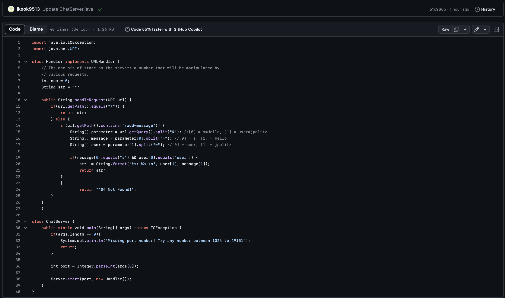
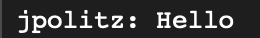
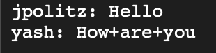
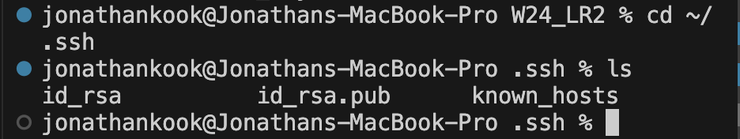
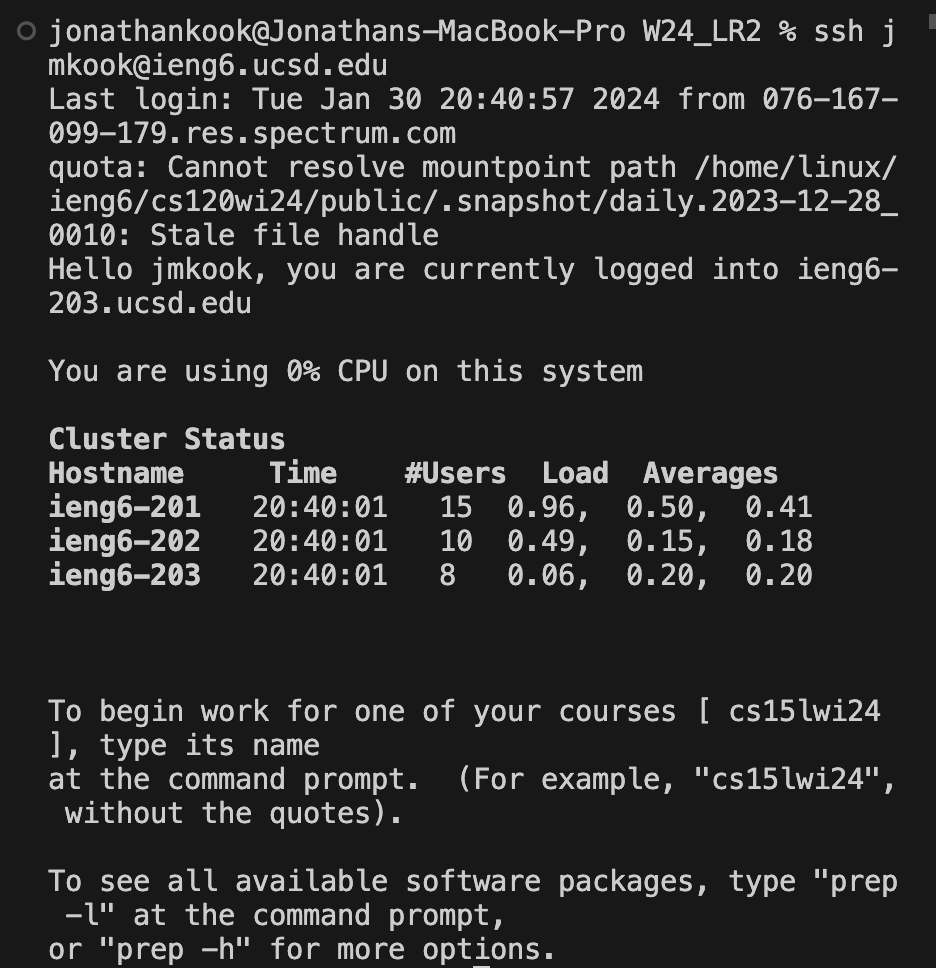

* The code for '/ChatServer.java' is shown in the screenshot above.

* In the screenshot above, the 'handleRequest' method is called. The only relavant argument for this method is 'URI URL'.
* The relavant fields in the class are the string 'str' and the three arrays 'parameter', 'message', and 'user'.
* The value of 'str' is 'jpolitz: Hello'.
* The values in the 'parameter' array are: parameter[] = {s=Hello, user=jpolitz}
* The values in the 'message' array are: message[] = {s, Hello}
* The values in the 'user' array are: user[] = {user, jpolitz}
* All four of the values change from this request. The 'parameter' array takes the input from the URL and seperates it into two parts: before and after the & (s=Hello and user=jpolitz). Then the 'message' array takes the 0th value in the 'parameter' array (s=Hello) and splits into another two parts: before and after the =. Then the 'user' array takes the 1st value in the 'parameter' array (user=jpolitz) and splits into another two parts: before and after the = (user and jpolitz). For both the 'user' array and the 'message' array, the parts that are before the = will be the 0th value and the parts that are after the = will be the 1st value in their respective arrays. The 'str' string is then changed by adding onto a new line the 1st value from the 'user' array, followed by a comma and colon, followed by the 1st value from the 'message' array.

* In the screenshot above, the 'handleRequest' method is called. The only relavant argument for this method is 'URI URL'.
* The relavant fields in the class are the string 'str' and the three arrays 'parameter', 'message', and 'user'.
* The value of 'str' is 'jpolitz: Hello \nyash: How are you'.
* The values in the 'parameter' array are: parameter[] = {s=How+are+you, user=yash}
* The values in the 'message' array are: message[] = {s, How+are+you}
* The values in the 'user' array are: user[] = {user, yash}
* All four of the values change from this request. The 'parameter' array takes the input from the URL and seperates it into two parts: before and after the & (s=How+are+you and user=yash). Then the 'message' array takes the 0th value in the 'parameter' array (s=How+are+you) and splits into another two parts: before and after the =. Then the 'user' array takes the 1st value in the 'parameter' array (user=yash) and splits into another two parts: before and after the = (user and yash). For both the 'user' array and the 'message' array, the parts that are before the = will be the 0th value and the parts that are after the = will be the 1st value in their respective arrays. The 'str' string is then changed by adding onto a new line the 1st value from the 'user' array, followed by a comma and colon, followed by the 1st value from the 'message' array.

* The absolute path for both the private and public key are shown in the screenshot above. The absolute path for the private key is 'id_rsa'. The absolute path for the public key is 'id_rsa.pub'.

* The screenshot above shows me logging into my ieng6 account without being asked for a password.

* In weeks 2 and 3 I learned multiple new commands including `ssh`, `mkdir`, and `scp`. The `ssh` command is a protocol used to securely connect to a remote server or system. The `mkdir` command is a command used to create a new directory. The `scp` command copies files or directories between a local and a remote system, or between two remote systems. I also learned how to locally connect to a remote server.
